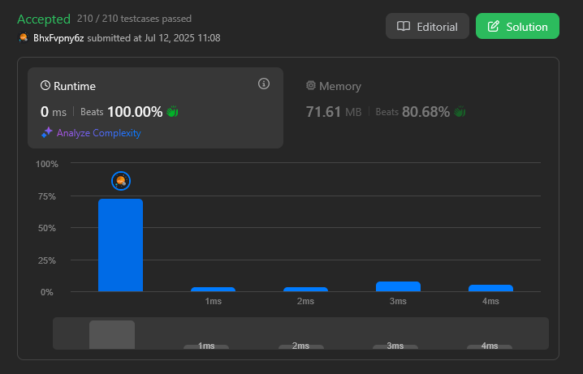
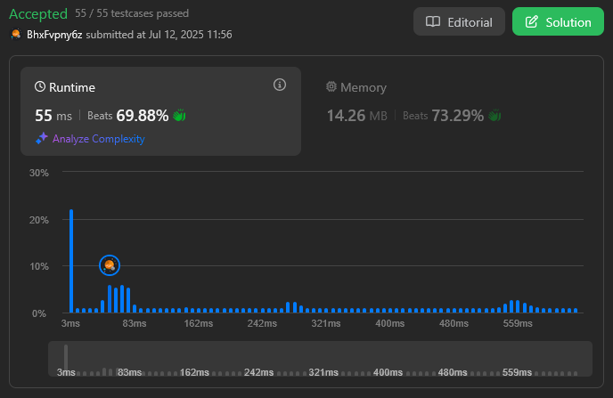
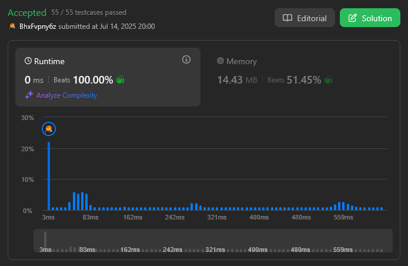
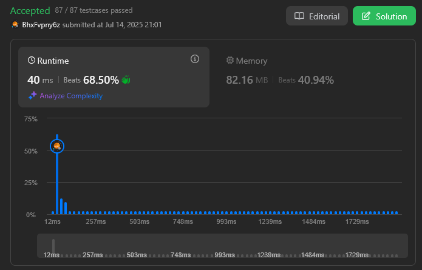

# PD_TheFinalAct

**Conteúdo da Disciplina**: Programação Dinâmica 

## Alunos
|Matrícula | Aluno |
| -- | -- |
| 22/1022014  |  João Vitor Lopes Ribeiro |
| 18/0066161  |  Luis Henrique Luz Costa |

## Sobre 
A entrega desse Trabalho de Programação Dinâmica da disciplina de Projeto de Algoritmos consiste em uma seleção de questões de dificuldade média e difícil do leetcode sobre o paradigma algorítmico de programação dinâmica estudado na disciplina.

| Questão | Dificuldade | Complexidade |
|--------|:-----------:|:-------------:|
| [53. Maximum subarray](https://leetcode.com/problems/maximum-subarray/description/) | Média | O(n)
| [300. Longest Increasing Subsequence](https://leetcode.com/problems/longest-increasing-subsequence/description/) | Média | O(n²) |
| [300. Longest Increasing Subsequence](https://leetcode.com/problems/longest-increasing-subsequence/description/) | Média | O(nlog(n)) |
| [354. Russian Doll Envelopes](https://leetcode.com/problems/russian-doll-envelopes/description/) | Difícil | O(nlog(n)) | 

## Screenshots

### [53. Maximum subarray](https://leetcode.com/problems/maximum-subarray/description/)

### [300. Longest Increasing Subsequence - O(n²)](https://leetcode.com/problems/longest-increasing-subsequence/description/)

### [300. Longest Increasing Subsequence - O(nlog(n))](https://leetcode.com/problems/longest-increasing-subsequence/description/)

### [354. Russian Doll Envelopes](https://leetcode.com/problems/russian-doll-envelopes/description/)

## Instalação 
**Linguagem**: C++ 

Os códigos foram feitos para solucionar os problemas na plataforma Leetcode, portanto é necessário ter uma conta na plataforma.

## Uso 

1. Faça Sign In na plataforma Leetcode;
2. Copie o código de solução do problema do repositório; 
3. Acesse a página do problema;
4. Cole o código no editor do Leetcode;
5. Submeta o código;
6. Receba o resultado do teste do código sob as entradas do problema.

Obs.: não copie includes ou namespaces, ao inclui-los para submissão no leetcode os resultados são impactados negativamente.

## Entregas 
[Entrega - Programação Dinâmica (Acessar o vídeo)](https://youtu.be/GxqKIR3CZ_8)
